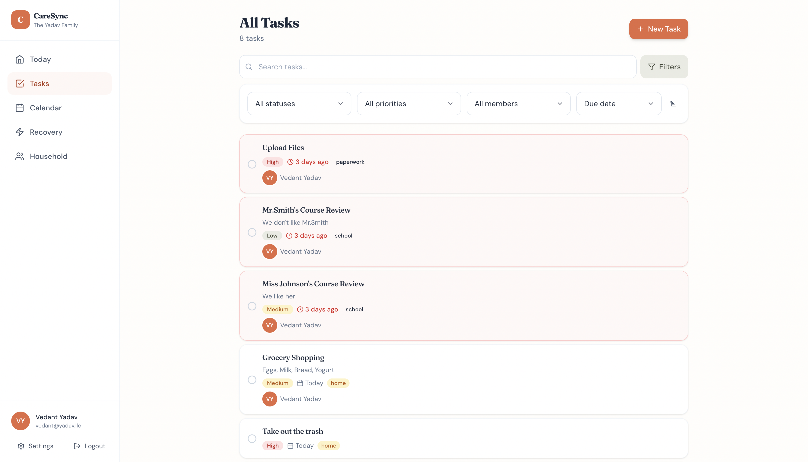
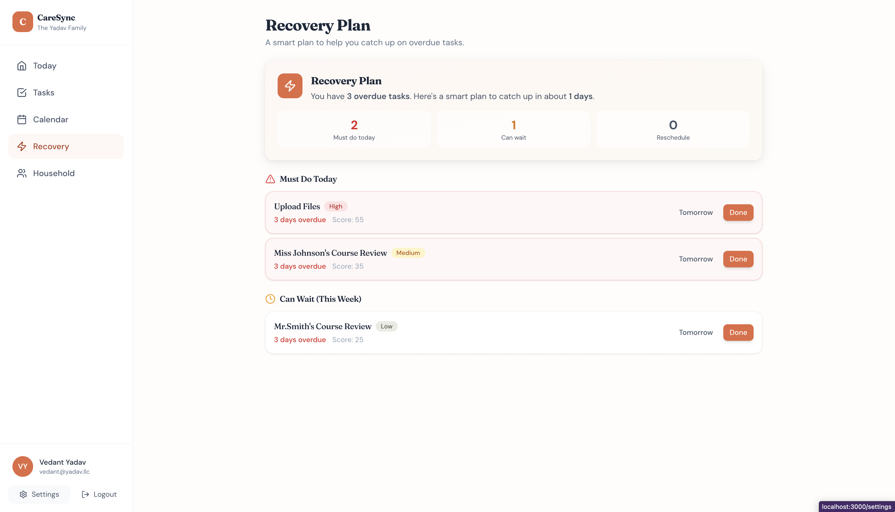
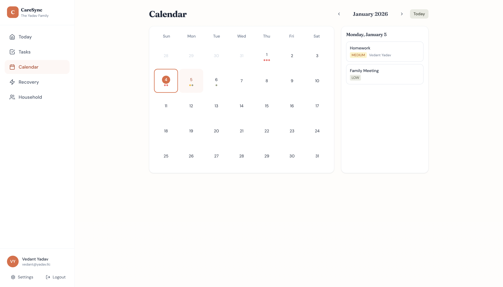
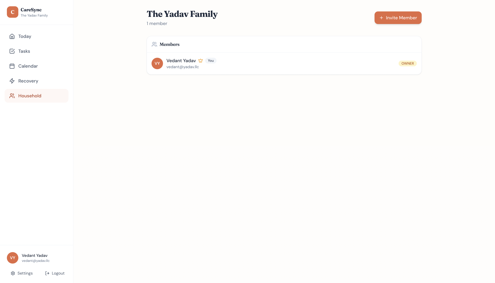

# CareSync

**A shared home support planner for families juggling school, work, and caregiving.**


## Problem

Managing a household while balancing school and family responsibilities is overwhelming—especially when your family is stretched across continents. Traditional to-do apps fall short because they:

- Lack shared ownership and accountability across distances
- Don't understand recurring household routines
- Provide no recovery plan when tasks pile up during stressful weeks
- Can't track progress when multiple people are juggling responsibilities

I built CareSync because I needed a tool that understood real life, not just checked boxes.

## Why I Built It

In the summer of 2024, I stood beside my uncle during the funeral rites for my grandfather in Jaipur. I was sixteen and the oldest of my generation, and in that moment I felt the weight of adulthood settle on my shoulders sooner than I expected. Eight weeks later, my uncle also passed away. School had already started in California, so I couldn't return to India.

After those losses, my family had to manage responsibilities in both California and Jaipur. My dad began traveling often to India to help relatives and handle business matters. When he was abroad, my mom managed our home while staying involved in decisions overseas. I stepped in to support her—running errands, caring for our dog, keeping the house running so my parents could focus on what only they could handle.

I started with a whiteboard for bills and reminders. I made lists of house needs and took charge of groceries, pharmacy runs, and communication with relatives in India. But sticky notes and mental lists weren't enough. Some things slipped through the cracks during hard weeks. I needed something better.

When I went to NYU, the challenge became harder. I was three thousand miles away, taking CS and math classes that started before my family on the West Coast even woke up. I still tried to help through late-night calls, scanned documents, and planning spreadsheets—but there's a limit to what you can do from that far away. Some weeks I stayed up past 1 AM finishing assignments and then joined long calls about family decisions because it felt wrong letting my mom carry everything alone.

CareSync is the tool I wish I had—one that helps families collaborate on household tasks across any distance, catches you when things slip through the cracks, and actually understands that life happens.

## Key Features

### 📋 Today Dashboard
Your command center showing what needs attention right now:
- **Overdue tasks** with visual urgency indicators
- **Due today** section with quick-complete actions
- **Upcoming tasks** for the next 7 days
- **Weekly progress stats** to celebrate wins

### 👥 Shared Task Management
True household collaboration:
- Assign tasks to specific family members
- See who's responsible for what
- Track completion by person
- Unassigned task queue for grabbing

### 🔄 Smart Recurring Tasks
Set it and forget it:
- Daily, weekly, or monthly recurrence
- Auto-generates next instance when completed
- Perfect for chores, medications, bill reminders

### ⚡ Recovery Plan (Smart Feature)
When life gets overwhelming, CareSync helps you catch up:
- **Urgency scoring** based on priority + overdue days + task type
- **Must do today** vs **Can wait** categorization
- **Estimated catch-up timeline**
- One-click actions to complete or reschedule

### 📅 Calendar View
Visualize your household schedule:
- Monthly calendar with task indicators
- Click any day to see scheduled tasks
- Color-coded by priority and status

### 🏠 Household Management
Keep everyone connected:
- Invite family members via email
- Role-based permissions (Owner/Member)
- See all members at a glance

## Tech Stack

| Layer | Technology |
|-------|------------|
| **Frontend** | Next.js 14 (App Router), TypeScript, Tailwind CSS |
| **Backend** | Next.js API Routes, Server Components |
| **Database** | PostgreSQL (Supabase) |
| **ORM** | Prisma |
| **Auth** | Custom JWT-based sessions |
| **Deployment** | Vercel |

## Architecture Overview

### Data Model

```
User
├── id, email, name, passwordHash
├── memberships → HouseholdMember[]
├── createdTasks → Task[]
└── assignedTasks → Task[]

Household
├── id, name
├── members → HouseholdMember[]
├── tasks → Task[]
└── invites → Invite[]

Task
├── id, title, description
├── priority (LOW | MEDIUM | HIGH)
├── status (OPEN | IN_PROGRESS | DONE)
├── dueAt, completedAt
├── tags[], recurrenceRule
├── householdId, createdById, assignedToId
└── createdAt, updatedAt
```

### Permission Model

- **Owner**: Full household control (invite, remove members, manage settings)
- **Member**: Create, edit, complete, and delete tasks
- **Viewer**: Read-only access (future feature)

### Recurrence Logic

When a recurring task is marked complete:
1. Record completion timestamp
2. Calculate next due date based on rule (daily/weekly/monthly)
3. Create new task instance with same properties
4. New task starts in OPEN status

### Recovery Plan Algorithm

The Recovery Plan feature came from my real experience of coming back from a hard week and facing a wall of overdue tasks. Instead of panicking, I learned to mentally sort: *what actually needs to happen today vs. what can wait?*

I turned that mental process into code:

```typescript
urgencyScore = (priorityWeight × 10) + (daysOverdue × 5, max 30) + (urgentTagBonus)

// Priority weights: HIGH=3, MEDIUM=2, LOW=1
// Urgent tags: health, bills, appointments, paperwork (+10 points)

// Categorization:
// - Top 3 HIGH priority → "Must do today"
// - Top 5 with score ≥ 30 → "Must do today"  
// - LOW priority, >7 days overdue → "Reschedule"
// - Unassigned when >5 total → "Delegate"
// - Everything else → "Can wait"
```

The "health" and "bills" tags get bonus points because those are the categories that actually cause problems if they slip—missed medications or late payments have real consequences. The algorithm also suggests delegation for unassigned tasks when you're overwhelmed, because I learned that trying to do everything yourself is how things fall through the cracks.

## Screenshots

### Today Dashboard

*The main view showing today's tasks, stats, and quick actions*

### Task List with Filters

*Full task list with search, filters, and sorting*

### Recovery Plan

*Smart prioritization when tasks pile up*

### Calendar View

*Monthly view with task indicators*

### Household Members

*Manage family members and invites*

## Demo

- **Live Site**: [caresync-ten.vercel.app](https://caresync-ten.vercel.app)
- **Demo Video**: [90-second walkthrough](https://youtu.be/0ryE9hbtAdc)

## Getting Started

### Prerequisites

- Node.js 18+
- PostgreSQL database (or Supabase account)
- npm or yarn

### Installation

1. **Clone the repository**
```bash
   git clone https://github.com/vedant-yadav-git/caresync.git
   cd caresync
```

2. **Install dependencies**
   ```bash
   npm install
   ```

3. **Set up environment variables**
   ```bash
   cp .env.example .env
   ```
   
   Fill in your values:
   ```
   DATABASE_URL="postgresql://..."
   JWT_SECRET="your-secret-key"
   NEXT_PUBLIC_APP_URL="http://localhost:3000"
   ```

4. **Set up the database**
   ```bash
   npx prisma generate
   npx prisma db push
   ```

5. **Run the development server**
   ```bash
   npm run dev
   ```

6. **Open [http://localhost:3000](http://localhost:3000)**

## Testing

```bash
# Run type checking
npm run lint

# Run Prisma validation
npx prisma validate
```

## Roadmap

Future improvements planned:

- [ ] **Email notifications** - Daily digest of upcoming and overdue tasks (so my mom doesn't have to check the app constantly)
- [ ] **Time zone support** - Show tasks in each user's local time (critical for California ↔ India coordination)
- [ ] **Mobile app** - React Native companion for quick updates on the go
- [ ] **Routines/Templates** - "Sunday Reset" creates multiple tasks at once (groceries, laundry, meal prep, weekly planning)
- [ ] **Household Notes** - Shared info page for important numbers, account info, instructions (the kind of stuff that used to live on our whiteboard)
- [ ] **Weekly Summary** - Automated accountability report showing who did what
- [ ] **Document storage** - Attach scanned documents to tasks (for the paperwork that comes with managing things across borders)
- [ ] **Google Calendar sync** - Two-way sync so tasks show up where people already look

## What I Learned

### Technical Growth
- **Server Components vs Client Components**: Understanding when to use each for optimal performance
- **Optimistic UI updates**: Making the app feel responsive while waiting for API calls
- **Database schema design**: Balancing normalization with query performance
- **Recovery Plan algorithm**: Translating the mental prioritization I did for my family into actual code

### Tradeoffs Made
- Chose simple JWT auth over NextAuth for learning and control
- Prioritized the Recovery Plan feature over email notifications—because when things pile up, knowing *what to do first* matters more than being reminded that you're behind
- Used Prisma instead of raw SQL for faster iteration

### One Mistake I Fixed
Initially, the task completion didn't check for recurrence before redirecting. Users would complete a recurring task, see it disappear, but the next instance wasn't created until they refreshed. Fixed by making recurrence creation synchronous and optimistically updating the UI. This mattered because recurring tasks (like medication reminders or weekly grocery runs) are exactly the kind of thing that can't slip through the cracks.

### If I Redesigned It
I would add real-time updates using WebSockets or Supabase subscriptions. When one family member completes a task, others should see it immediately without refreshing. This is especially important when you're coordinating across time zones—my mom in California shouldn't have to wonder if I already handled something from New York.

### Connection to My Academic Journey
Building CareSync drew directly on what I learned in my CS courses. The urgency scoring algorithm for the Recovery Plan uses concepts from my Data Structures class—prioritizing tasks is essentially a weighted sorting problem. The database schema design came from thinking about relationships and normalization from Discrete Math. And the habit of breaking complex problems into smaller steps? That's the same approach that helped me turn a failing first test in AP Calculus into an A-minus by meeting my teacher at 7 AM three days a week.

This project taught me that the skills I'm building in computer science aren't abstract—they're tools for solving real problems in my actual life.

## Contributing

Contributions welcome! Please read the contributing guidelines first.

## License

MIT License - see LICENSE file for details.

---

Built with ❤️ while learning that leadership can be quiet, steady, and in the background—and that the best tools are the ones that solve problems you actually have.
